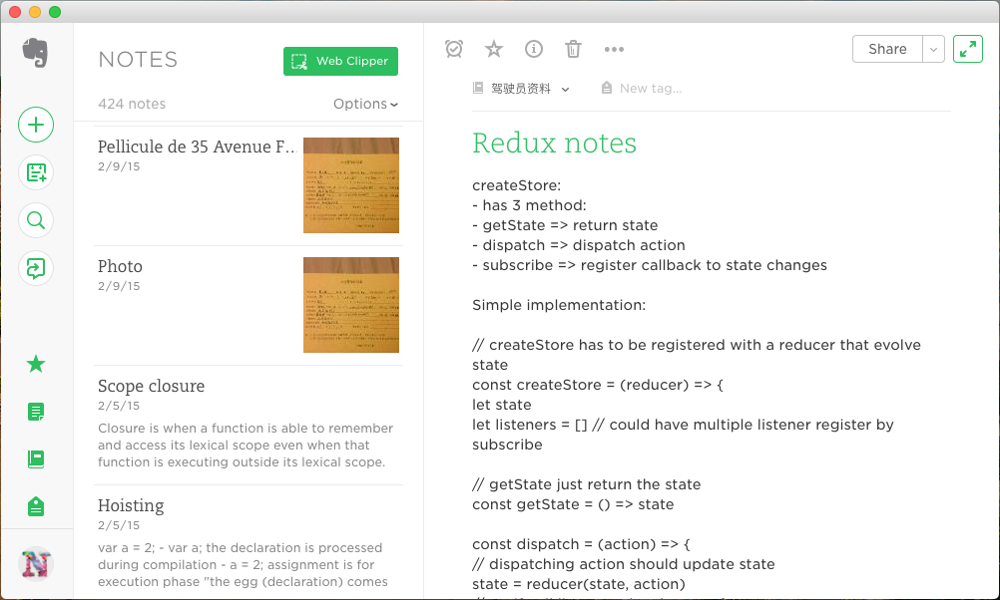
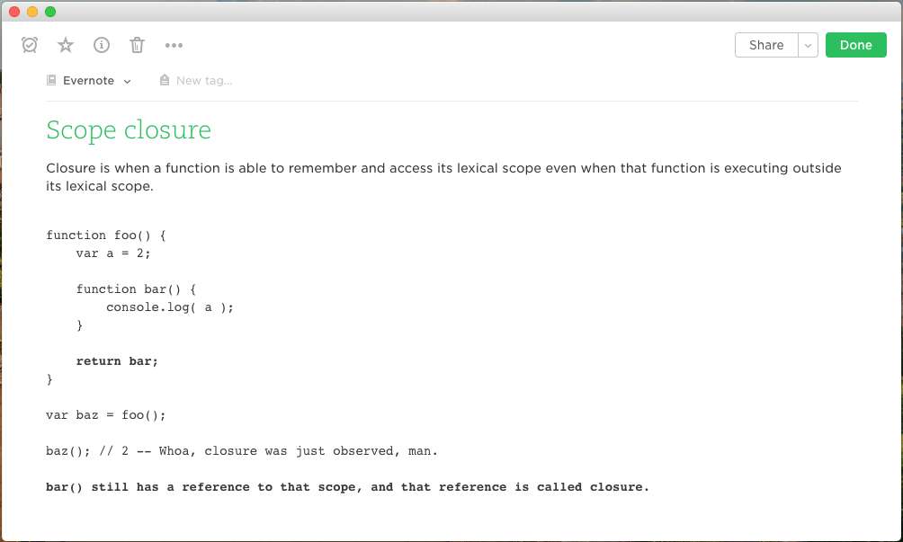

# Evernote Panel

I love the Evernote web, it's clean, fast and has just enough features for me.

This Chrome extension is just a wrapper of Evernote web into a clean panel, get ride of any distraction of a browser window when you write.

## Instaillation Guide

Chromebook user can find it [here](https://chrome.google.com/webstore/detail/evernote-panel/lblgfgbpbmahmhnbijoiaocjkgppgfmj).

Unfortunately Google changed their [chrome app policy](https://blog.chromium.org/2016/08/from-chrome-apps-to-web.html) for other plateforms, so the recent app on chrome store is only avaible for Chromebook. But if you'd like to try this app, you could still download and install it under [deveper mode](https://www.howtogeek.com/233355/how-to-install-extensions-from-outside-the-chrome-web-store-and-firefox-add-ons-gallery/).
